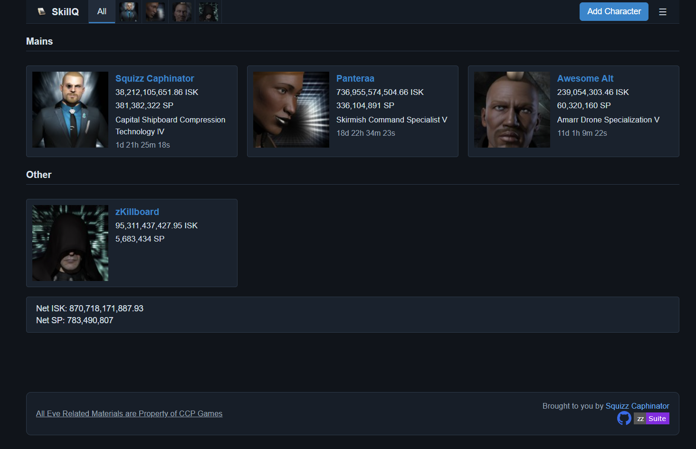
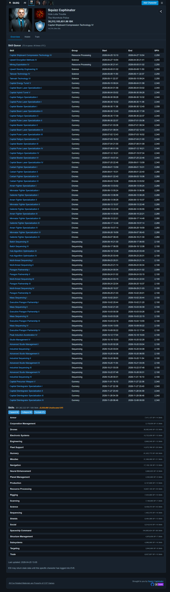

# SkillQ
A web based Skill Monitor for Eve Online.

### What is SkillQ?
SkillQ lets you monitor all your EVE Online characters in one place from any browser.

**Everything is stored locally in your browser.** SkillQ does not run a backend database or user-account system. Your character data, wallet history, and settings are kept entirely in your browser's IndexedDB and are never sent to any SkillQ server. Logging out erases all locally stored data from the device.

### Features

- **Multi-character dashboard**: view all your characters on one page with live training countdowns and wallet balances
- **Skill overview**: browse every trained skill grouped by category, with queue and training-in-progress highlights
- **Skill queue**: see the full active queue with finish times and SP/hour rates
- **Training advisor**: ranked list of skills to train next based on your current attributes and implants
- **Wallet journal**: recent wallet transactions with party name resolution
- **Character groups and ordering**: organise characters into named groups and sort by SP, ISK, queue finish time, or a custom order
- **Shareable character links**: generate a signed, compressed share URL that lets anyone view a snapshot of your skills and queue (automatically invalidates if you change corporations)
- **Fully local storage**: all data lives in your browser's IndexedDB; no SkillQ account or server-side database required
- **Dark / light / system theme**: choose your preferred colour scheme from Settings
- **Restricted or fluid layout**: fixed three-column card layout or fluid full-width mode

### Shares

SkillQ can generate a snapshot link from a character overview page.

> **Important share caveats**
>
> - **Snapshot-based**: the share represents one point in time, not a live feed.
> - **Queue cap**: only the first 25 queue entries are included in the share payload.
> - **Completed queue rows are hidden from the queue table** on shared pages.
> - **Completed queue progress is folded into Shared Skills levels** (example: if snapshot shows III but queued IV has already finished by view time, Shared Skills shows IV as completed).
> - **Expiry**: shares expire after 30 days.
> - **Corporation binding**: shares invalidate if the character changes corporations.
> - **Tampering warning**: URL data can be edited by a user, so treat shared data as informational.

Here are some example screenshots:

